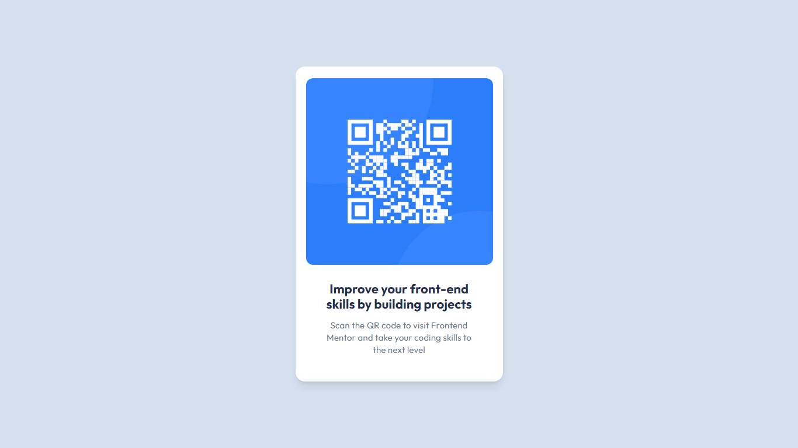

<h1>QR code component solution</h1>

This is a solution to the [QR code component challenge on Frontend Mentor](https://www.frontendmentor.io/challenges/qr-code-component-iux_sIO_H).

</img>

- Solution URL: [Frontend Mentor]()
- Live Site URL: [GitHub]()

<h2>Built with</h2>

- Semantic HTML5 markup
- CSS custom properties
- Tailwind CSS
- Figma
- Flexbox
- VS Code
- Google Fonts
- Git
- Mobile-first workflow
